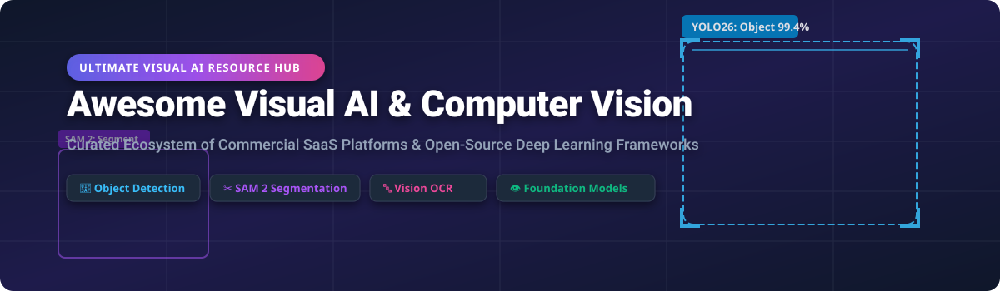

# 👁️ Awesome Visual AI & Computer Vision

  
  
  
  
  

## 🚀 Top Visual AI, Computer Vision & Multimodal Ecosystem

**Curated Hub of Commercial SaaS Products, Cloud Vision APIs, Foundation Models & Open-Source GitHub Projects**

*Focused on Real-Time Object Detection, Promptable Instance Segmentation, Multilingual OCR, Vision Language Models (VLMs) & Edge AI Deployment*

**Last updated: October 2026**

---

### 📌 Overview & Ecosystem Architecture
This repository tracks key **commercial computer vision APIs** and **open-source machine learning frameworks** that detect, classify, track, and segment visual content — from fully managed enterprise cloud APIs to self-hosted detection models and multimodal foundation models.

- **Enterprise SaaS Platforms**: Enterprise managed solutions including Salesforce Einstein Vision, Google Cloud Vision, AWS Rekognition, Azure Computer Vision, Clarifai, Roboflow, Landing AI, Chooch AI, AlwaysAI, and SuperAnnotate.
- **Open-Source Dominance**: High-speed edge detection led by **Ultralytics YOLO** (YOLO11 & YOLO26), research frameworks (**Detectron2**, **MMDetection**), foundational image processing (**OpenCV**), promptable segmentation (**SAM 2**), open-vocabulary detection (**GroundingDINO**), depth estimation (**Depth Anything**), and document extraction (**PaddleOCR**).

---

## 📑 Table of Contents
- [🏢 SaaS & Cloud Vision APIs](#-saas--cloud-vision-apis)
- [⚡ Open-Source GitHub Projects](#-open-source-github-projects)
- [📈 Star History](#-star-history)
- [🤝 How to Contribute](#-how-to-contribute)
- [💖 Support & Sponsorship](#-support--sponsorship)
- [⚠️ Disclaimer](#%EF%B8%8F-disclaimer)

---

## 🏢 SaaS & Cloud Vision APIs

The global visual AI and computer vision market size is estimated at **~$20 Billion to $25 Billion (2025/2026)** and is projected to surpass **$80 Billion by 2033** (growing at a ~20% CAGR). The market structure is **moderately fragmented**: hyper-scale cloud vendors (Microsoft, Google, AWS, Salesforce) dominate general-purpose cloud vision APIs and enterprise integrations, while specialized SaaS platforms (Roboflow, Landing AI, SuperAnnotate, Clarifai, Chooch) lead in custom developer pipelines, automated annotation, industrial visual inspection, and edge device orchestration.

| Product | Scale (Revenue / Valuation) | Starting Paid Tier Pricing | Free Tier / Trial Limit | Best For / Key Description |
| :--- | :--- | :--- | :--- | :--- |
| **[Azure Computer Vision](https://azure.microsoft.com/en-us/products/ai-services/ai-vision)** | **$331.8B** Annual Revenue (Microsoft) / **$3.93T** Market Cap | $1.00 per 1,000 transactions (S0 tier) | **5,000 transactions/month** (max 20 TPS) free forever (F0 tier) | **Best for Microsoft-centric vision applications** — image analysis, OCR, spatial analysis, Florence-2 model integration. |
| **[Google Cloud Vision](https://cloud.google.com/vision)** | **$475B** Annual Revenue (Alphabet) / **$3.93T** Market Cap | $1.50 per 1,000 units (1,001–5,000,000 units/mo) | **1,000 units/month** free forever + $300 90-day GCP trial credit | **Best for GCP-native vision applications** — image labeling, face detection, OCR, AutoML Vision custom training. |
| **[AWS Rekognition](https://aws.amazon.com/rekognition/)** | **$169B** Annual Revenue Run-Rate (AWS) | $1.00 per 1,000 images (Group 2 APIs) | **1,000 images/month** & 1,000 face metadata vectors/mo free for 12 months | **Best for AWS-native vision workloads** — object/scene detection, video stream analysis, custom labels. |
| **[Salesforce Einstein Vision](https://www.salesforce.com/)** | **$41.5B** Annual Revenue / **$218.8B** Market Cap | Included with Sales/Service Cloud Unlimited ($330/user/mo) or custom add-on | **Free developer org** with 1,000 predictions/month quota | **Best for CRM-integrated vision** — image classification & object detection inside Salesforce enterprise workflows. |
| **[Clarifai](https://www.clarifai.com/)** | **~$100M+** (Acquired by Nebius in May 2026) | $30/month (Essential plan base credit bundle) | **Free Community Plan** with limited monthly operations/credits | **Best for enterprise vision applications** — full-stack AI platform, pre-trained & custom models, edge deployment. |
| **[Roboflow](https://roboflow.com/)** | **$100M – $250M** Valuation ($63.6M funding) | $79/month billed annually ($99/mo monthly) | **Free Public Plan** with 10 credits/month for open-source & public projects | **Best for developers building custom vision models** — dataset management, annotation, auto-labeling, inference host. |
| **[Landing AI](https://landing.ai/)** | **$100M – $250M** Valuation ($57M funding) | $250/month starter credit pack ($1 = 100 credits) | **1,000 free credits** upon initial sign-up | **Best for industrial visual inspection** — Andrew Ng's platform for manufacturing quality control & ADE document AI. |
| **[SuperAnnotate](https://www.superannotate.com/)** | **~$50M – $150M** Est. Valuation ($68.6M funding) | $150/month (Starter team plan) / custom enterprise | **Free Plan** for up to 5 users with limited project & image quota | **Best for high-quality dataset creation** — annotation, QA, data curation for computer vision & multimodal AI. |
| **[Chooch AI](https://chooch.ai/)** | **$50M – $100M** Valuation ($20M+ funding) | Custom enterprise quote (historical entry ~$25–$100/mo) | **Free Account** access to AI Vision Studio with initial trial credits | **Best for enterprise video & image analytics** — computer vision platform for real-time video stream analysis. |
| **[AlwaysAI](https://www.alwaysai.co/)** | **~$20M – $50M** Est. Valuation ($16M funding) | Custom enterprise quote (developer seat plans start ~$99/mo) | **Free Developer Account** with limited edge model deployments | **Best for edge vision deployment** — platform to build, test, and manage CV apps on edge devices. |

---

## ⚡ Open-Source GitHub Projects

Below is a comprehensive list of open-source computer vision repositories, foundation models, and deep learning tools, **sorted by GitHub Star Count (Descending)**.

| Repository | GitHub Stars Badge | License | Primary Category & Key Highlights |
| :--- | :--- | :--- | :--- |
| **[OpenCV](https://github.com/opencv/opencv)** |  | Apache-2.0 | **Foundational Vision**: The classic C++/Python library for image processing, feature extraction, object tracking, and camera calibration. |
| **[Tesseract OCR](https://github.com/tesseract-ocr/tesseract)** |  | Apache-2.0 | **OCR Engine**: Standard open-source optical character recognition engine supporting 100+ languages. |
| **[Ultralytics YOLO](https://github.com/ultralytics/ultralytics)** |  | AGPL-3.0 | **Real-Time Detection**: De facto standard framework featuring YOLO11 and YOLO26 (40.9 mAP nano, NMS-free inference, export to ONNX/TensorRT). |
| **[PaddleOCR](https://github.com/PaddlePaddle/PaddleOCR)** |  | Apache-2.0 | **Multilingual OCR**: State-of-the-art document parsing and text recognition toolkit with 100+ language support and PaddleOCR-VL. |
| **[YOLOv5](https://github.com/ultralytics/yolov5)** |  | AGPL-3.0 | **Object Detection**: Industry-favorite detection model baseline from Ultralytics with extensive community edge deployment tutorials. |
| **[Detectron2](https://github.com/facebookresearch/detectron2)** |  | Apache-2.0 | **Research Framework**: Meta's modular engine for object detection, instance segmentation, keypoint detection, and panoptic segmentation. |
| **[MMDetection](https://github.com/open-mmlab/mmdetection)** |  | Apache-2.0 | **Model Zoo & Detection**: OpenMMLab's comprehensive detection toolbox with 100+ pre-trained object detection architectures. |
| **[Segment Anything (SAM)](https://github.com/facebookresearch/segment-anything)** |  | Apache-2.0 | **Segmentation Foundation**: Meta's pioneer promptable image segmentation foundation model for zero-shot object masking. |
| **[EasyOCR](https://github.com/JaidedAI/EasyOCR)** |  | Apache-2.0 | **Python OCR**: Ready-to-use optical character recognition package supporting 80+ languages with minimal dependencies. |
| **[LLaVA](https://github.com/haotian-liu/LLaVA)** |  | Apache-2.0 | **Vision-Language Assistant**: Large Language and Vision Assistant connecting vision encoders with LLMs for multimodal conversational AI. |
| **[Albumentations](https://github.com/albumentations-team/albumentations)** |  | MIT | **Data Augmentation**: High-performance image augmentation library supporting 50+ geometric and color transformations for ML training. |
| **[Segment Anything 2 (SAM 2)](https://github.com/facebookresearch/sam2)** |  | Apache-2.0 | **Video & Image Segmentation**: Meta's unified model for promptable visual object segmentation in both real-time video streams and images. |
| **[Kornia](https://github.com/kornia/kornia)** |  | Apache-2.0 | **Differentiable Vision**: PyTorch-based GPU-accelerated computer vision library for end-to-end trainable deep vision pipelines. |
| **[GroundingDINO](https://github.com/IDEA-Research/GroundingDINO)** |  | Apache-2.0 | **Open-Vocabulary Detection**: Open-set object detection using natural language text prompts combined with DINO transformer architecture. |
| **[Depth Anything](https://github.com/LiheYoung/Depth-Anything)** |  | Apache-2.0 | **Monocular Depth Estimation**: SOTA zero-shot monocular depth estimation model for indoor, outdoor, and metric 3D reconstruction. |
| **[YOLOX](https://github.com/Megvii-BaseDetection/YOLOX)** |  | Apache-2.0 | **Anchor-Free Detection**: High-performance anchor-free YOLO series implementation from Megvii for competitive edge deployment. |
| **[scikit-image](https://github.com/scikit-image/scikit-image)** |  | BSD-3-Clause | **Scientific Image Processing**: Collection of algorithms for image filtering, thresholding, segmentation, and scientific image analysis in Python. |
| **[RAFT (Optical Flow)](https://github.com/princeton-vl/RAFT)** |  | BSD-3-Clause | **Motion Analysis**: Recurrent All-Pairs Field Transforms architecture providing state-of-the-art optical flow estimation for video. |

---

## 📈 Star History

---

## 🤝 How to Contribute

Contributions are warmly welcome! Help make this curated visual AI directory even better.

1. **Fork** the repository.
2. Add your suggested SaaS product or open-source tool to `README.md` following the table formatting.
3. Ensure open-source projects include their star badge, license, and primary category.
4. Submit a **Pull Request** with a clear title and short summary of your addition.

---

## 💖 Support & Sponsorship

If you find this repository helpful for your computer vision research, machine learning projects, or enterprise tech stack evaluation, please consider showing your support:

- ⭐ **Star** this repository on GitHub to increase its visibility.
- 🔀 **Fork** and share it with your fellow computer vision engineers & data science teams.
- ☕ **Sponsor & Buy Me a Coffee**: If you'd like to support ongoing open-source curation and development, consider sponsoring via the [GitHub Sponsor Dashboard](https://github.com/sponsors/ishandutta2007).

---

## ⚠️ Disclaimer

- This list is **community-curated** for educational and research purposes — it is not exhaustive and does not constitute formal commercial endorsement.
- Visual AI platforms process image and video streams that may contain sensitive data or Personally Identifiable Information (PII). Ensure proper security hardening, access controls, and compliance with data privacy laws (GDPR, CCPA, BIPA).
- **Licensing Considerations**: Verify licenses before commercial use (e.g., Ultralytics YOLO uses AGPL-3.0 which requires open-sourcing derived software or purchasing an enterprise license, while Detectron2, OpenCV, SAM 2, and PaddleOCR use permissive Apache-2.0).

---

  <b>Built for Computer Vision Engineers, ML Practitioners &amp; Visual AI Architects</b> 
  Maintained by <a href="https://github.com/ishandutta2007">Ishan Dutta</a>

